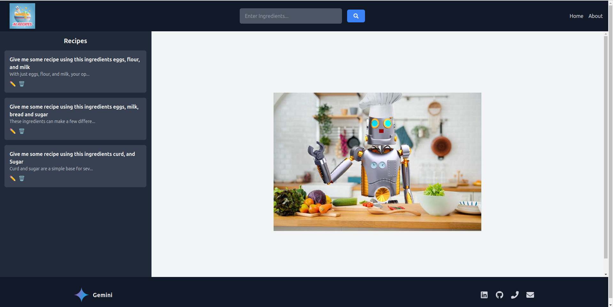
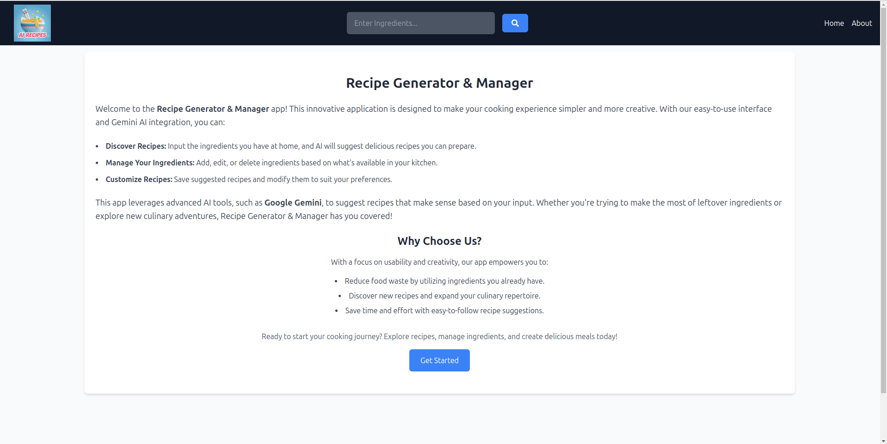
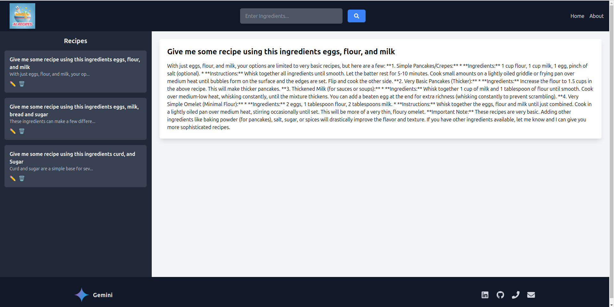

---

# Recipe Generator & Manager

This is an application for managing recipes. You can add, edit, view, and delete recipes. It's perfect for anyone looking to keep their favorite recipes organized in one place.

---

## Features

- **Add Recipes**: Save new recipes with a name, ingredients, and instructions.
- **Edit Recipes**: Update details of existing recipes.
- **View Recipes**: Browse through your recipe collection.
- **Delete Recipes**: Remove recipes you no longer need.

---


# *Backend Project Information***
## Installation

Follow these steps to set up the project on your local machine:

1. **Clone the Repository**:
   ```
   git clone https://github.com/sohanvishwas/Recipe-Generator.git
   ```

2. **Navigate to the Project Folder**:
   ```
   cd Recipe-Generator
   cd Backend
   ```

3. **Install Dependencies**:
   ```
   npm install
   ```

---

## Running the Project

1. **Start the Development Server**:
   ```
   node --watch main.js
   ```

2. Open your browser and go to [http://localhost:3002](http://localhost:3002) to use the app.

---

## Folder Structure

The project is organized as follows:

```
Recipe-Generator/
├── Backend/
│   ├── ainintegration/
│   │   └── geminiAi.js
│   ├── controllers/
│   │   └── responseController.js
│   ├── models/
│   │   └── response.js
│   ├── mongoDB/
│   │   └── db.js
│   ├── node_modules/
│   ├── routes/
│   │   └── responseRoutes.js
│   ├── .env
│   ├── .gitignore
│   ├── main.js
│   ├── package-lock.json
│   ├── package.json
│   ├── README.md
│   └── vercel.json
```

### Explanation of Key Folders and Files:

- **`Backend/`**: Contains all backend-related code.
  - **`aintegration/`**: Houses AI integration logic (e.g., `geminiAi.js`).
  - **`controllers/`**: Includes controller logic (e.g., `responseController.js`).
  - **`models/`**: Defines database models (e.g., `response.js`).
  - **`mongoDB/`**: Contains database connection logic (e.g., `db.js`).
  - **`routes/`**: Defines API routes (e.g., `responseRoutes.js`).

- **`.env`**: Environment configuration file.
- **`.gitignore`**: Specifies files to be ignored by Git.
- **`main.js`**: Entry point for the application.
- **`package.json`**: Contains project metadata and dependencies.
- **`vercel.json`**: Configuration for deployment on Vercel.
- **`node_modules/`**: Auto-generated folder for installed dependencies (not manually modified).

---


# *Frontend Project Information***
## Installation
How to Install project dependencies in Frontend

- npm install dependencies_name

## How many Dependencies use in frontend
 react, tailwind CSS, axios, react-icons, react-toastify, react-router-dom

## Running the Project
## How to start frontend server
- *start server :* npm run dev

## Frontend Deployed Link
### *The frontend is live and accessible at the following link *
[Frontend live link](recipe-generator-7b98.vercel.app/)

## Folder Structure

The project is organized as follows:
```
Recipe-Generator/
├── frontend/  
├── public/  
│   └── vite.svg  
├── src/  
│   ├── assets/  
│   │   ├── logo.jpeg  
│   │   ├── react.svg  
│   │   └── recipe-image.jpg  
│   ├── Components/  
│   │   ├── About.jsx  
│   │   ├── body.jsx  
│   │   ├── footer.jsx  
│   │   └── Navbar.jsx  
│   ├── App.css  
│   ├── App.jsx  
│   ├── index.css  
│   └── main.jsx  
├── .gitignore  
├── eslint.config.js  
├── index.html  
├── package-lock.json  
├── package.json  
├── postcss.config.js  
├── README.md  
├── tailwind.config.js  
└── vite.config.js  

```


## Home Page, About Page & Recipe Page

<p align="center" style="display: flex; justify-content: space-between;">
  
</p>
<p align="center" style="display: flex; justify-content: space-between;">
  
</p>
<p align="center" style="display: flex; justify-content: space-between;">
  
</p>


## Notes

- Ensure sensitive files like `.env` are included in `.gitignore` to prevent accidental commits.
- Replace `<repository-url>` with the actual URL of your repository.
- Add more details as needed, such as "Usage", "Testing", or "Known Issues".
- Ensure that the backend API endpoints and request/response formats match your actual implementation.

